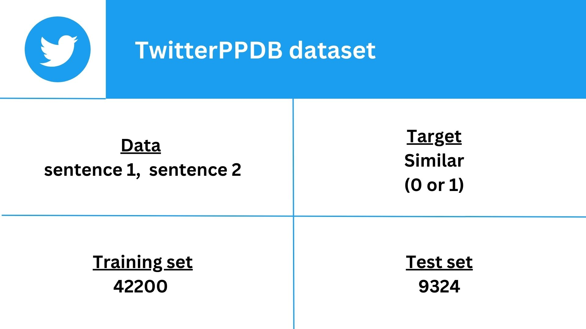
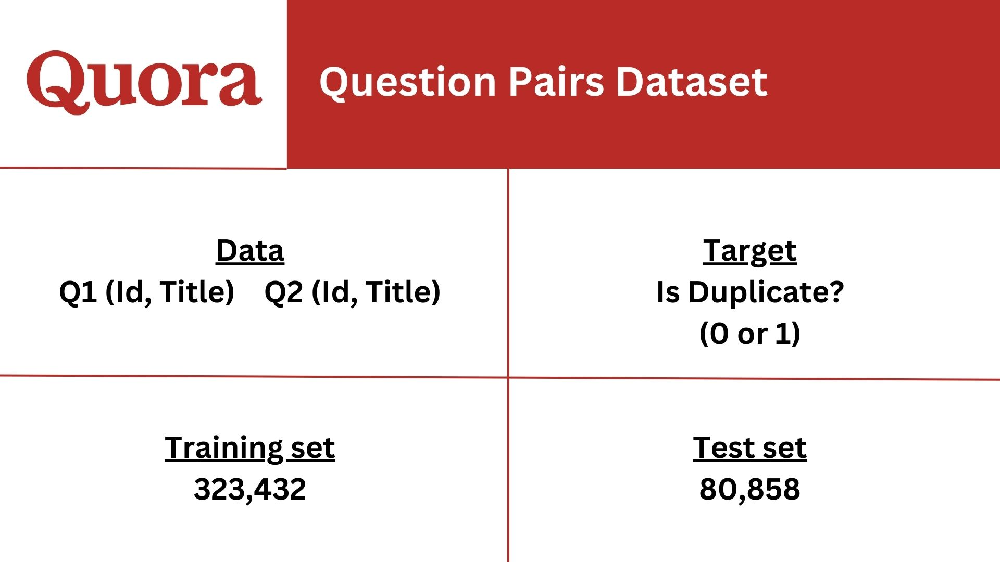
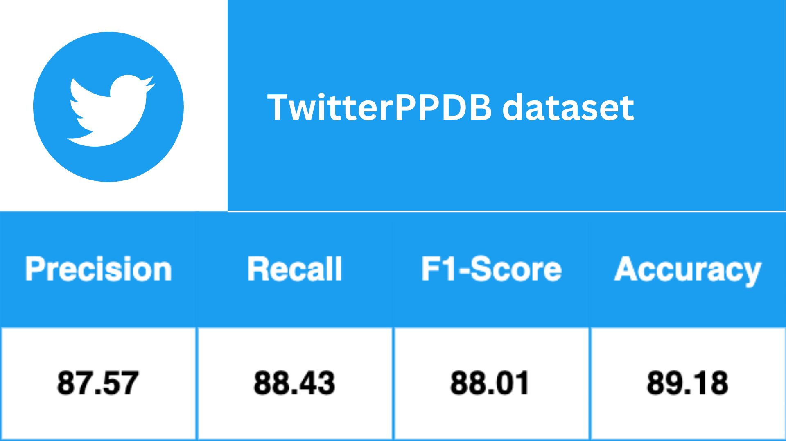
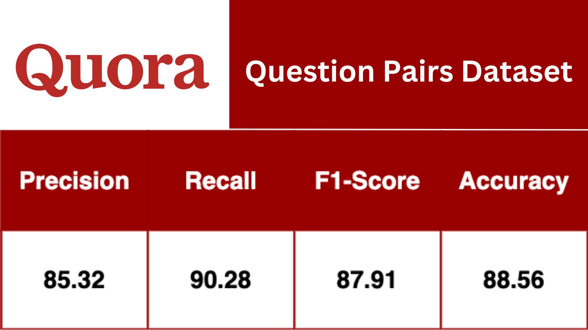

<h1>CSCI 544: Applied Natural Language Processing</h1>

<h2>Project: ParaBERT-Paraphrase-Identification-using-Siamese-BERT-and-Hand-Crafted-Features</h2> 

 
  <table>
    <tr>
      <td><b>Group Number</b></td>
      <td>42</td>
    </tr>
    <tr>
      <td><b>Team Member 1</b></td>
      <td>Kriti Asija</td>
    </tr>
    <tr>
      <td><b>Team Member 2</b></td>
      <td>Parth Rohilla</td>
    </tr>
    <tr>
      <td><b>Team Member 3</b></td>
      <td>Nishthavan Dahiya</td>
    </tr>
    <tr>
      <td><b>Team Member 4</b></td>
      <td>Darsh Patel</td>
    </tr>
    <tr>
      <td><b>Team Member 5</b></td>
      <td>Soham Khade</td>
    </tr>
  </table>
  <h4><u>Professor</u>: <b>Mohammad Rostami</b></h4>

<h3>Dataset</h3>
<!-- 
  -->

<h3>Results</h3>

<!--   -->

<!-- 
<h4>TwitterPPDB Dataset</h4>
<table>
<tr><td>Data</td><td>sentence 1, sentence 2</td></tr>
<tr><td>Target</td><td>Similar (0 or 1)</td></tr>
<tr><td>Training Set</td><td>42200</td></tr>
<tr><td>Testing Set</td><td>9324</td></tr>
</table>

<h4>Quora Question Pairs Dataset</h4>
<table>
<tr><td>Data</td><td> Q1 (Id, Title),  Q2 (Id, Title)</td></tr>
<tr><td>Target</td><td>Is Duplicate? (0 or 1)</td></tr>
<tr><td>Training Set</td><td>323432</td></tr>
<tr><td>Testing Set</td><td>80858</td></tr>
</table>

<h3>Results</h3>
<h4>Quora Question Pairs Dataset</h4>
<table>
<tr><td>Precision</td><td>85.32</td></tr>
<tr><td>Recall</td><td>90.28</td></tr>
<tr><td>F1-Score</td><td>87.91</td></tr>
<tr><td>Accuracy</td><td>88.56</td></tr>
</table>

<h4>TwitterPPDB Dataset</h4>
<table>
<tr><td>Precision</td><td>87.57</td></tr>
<tr><td>Recall</td><td>88.43</td></tr>
<tr><td>F1-Score</td><td>88.01</td></tr>
<tr><td>Accuracy</td><td>89.18</td></tr>
</table>

 -->
